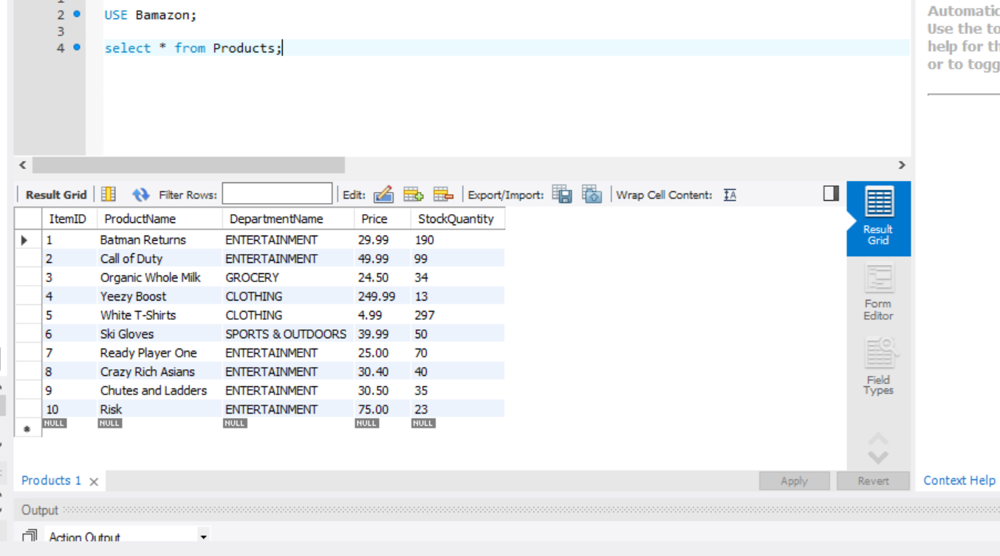
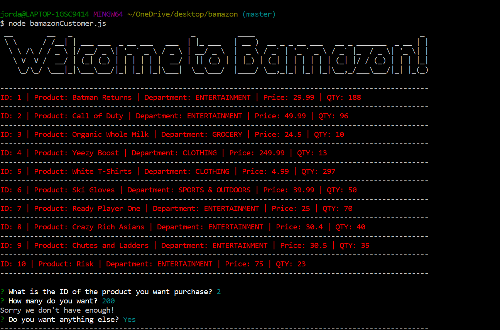
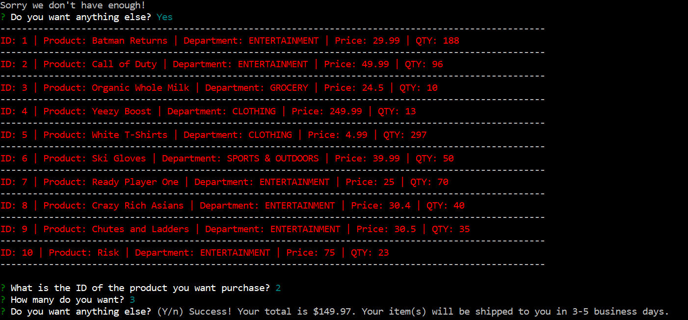

# bamazon

# Node.js & MySQL

## Overview

An Amazon-like storefront that takes in orders from a "customer" and depletes the stock from the store's inventory in the DB.

Make sure you save and require the MySQL and Inquirer npm packages in your homework files--your app will need them for data input and storage.

## NPM Installs

Install the require, figlet and cli-color packages.

### Overview of MySQL database - located in the schema.sql file

Database name is Bamazon.

There is a table called Products.

Products has 4 columns that are broken down into the Item's ID, name of the product, department, cost and quantity.

The DB was populated with 10 products.

### Overview of JS file

There is a Node application called bamazonCustomer.js. Running this application will first display all of the items available for sale. 

It then prompts users with two messages.

The first ask them the ID of the product they would like to buy.

The second message asks how many they would like to buy.

Once an order has been placed the application then checks to see if the store has enough of the product to meet the user's request.

If there is not sufficient quantity in stock the app will log "Sorry we don't have enough!" and will ask the user again.

If user asks for a product that has sufficient quantity the app will log a success message with the price they are charged and if they want to buy any more items.

